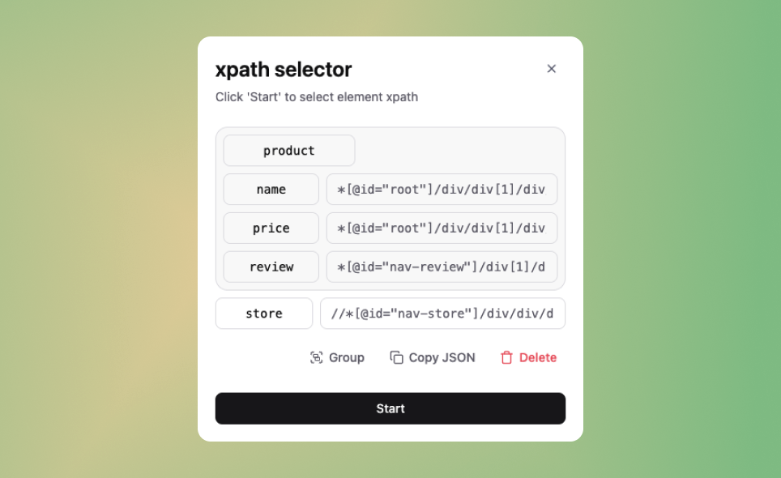

# xpath-selector



A simple React-based extension for selecting, naming, grouping and extracting xpaths from web pages. Designed for developers who need to structure and organize their web scraping projects.

This extension features:

- **minimal-ui**: built with `shadcn/ui` for a clean and mordern look
- **interactive-selection**: use a custom inspect-element tool to pick elements from any web pages
- **custom-naming**: assign meaningful name to each selected xpath for clarity
- **grouping**: group related xpath under a common ancestor
- **structured-export**: export all selected and grouped xpaths as a well-organized JSON

## Getting the extension

Clone the repository:

```sh
git clone https://github.com/EzekielSuresh/xpath-selector
cd xpath-selector
```

Install dependencies:

```sh
npm install
```

Build the project:

```sh
npm run build
```

Load the extension in Chrome:

- Open `chrome://extensions/`
- Enable **Developer Mode**
- Click **Load unpacked**
- Select the `dist/` folder

## Output

The exported JSON structure will look like this:

```json
}
  "xpaths": {
    "item 1": "...",
    "item 2": "..."
  },
  "groups": {
    "group 1": {
      "common_xpath": "...",
      "fields": {
        "item 1": "...",
        "item 2": "..."
      }
    }
  }
}
```

## Contributing

Contributions are welcome! If you have suggestions for improvements, bug fixes or new features, feel free to open an [issue](https://github.com/EzekielSuresh/xpath-selector/issues).

## License

MIT License © [Ezekiel Suresh Murali](https://github.com/EzekielSuresh)